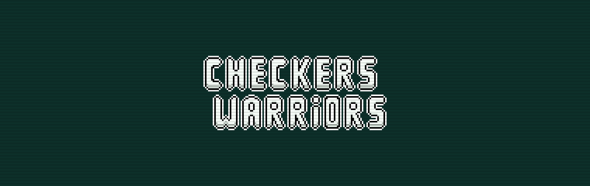

<h1 align="center">Checkers Warriors</h1>

Checkers is a classic board game, now imagine with pixel art and some gameplay updates.   Well, this is <strong>Checkers Warriors</strong>!

    
    

## Content Table
- [Content Table](#content-table)
- [License](#license)
- [Contact](#contact)

## License
Distributed under the GPL v3.0 license. See [`LICENSE`](LICENSE.md) for more information.

## Contact
Victor Gabriel • [Github](https://github.com/rocketseat) • **victorgabriel101106+github@gmail.com**